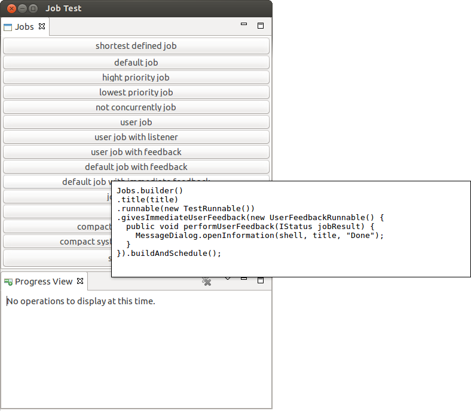

JobBuilder
==========

Following the builder pattern this API allows to create and schedule Eclipse jobs in an easy manner.

## A few examples

### Build and schedule a system job with a Runnable
```java
Jobs.builder()
	.title("Very important task in progress")
	.isSystemJob()
	.runnable(new Runnable() {
		public void run() {
			doImportantTask();
		}
	}).buildAndSchedule();
```

### Build and schedule a user job with a IRunnableWithProgress
```java
Jobs.builder()
	.title("Very important task triggered by user").isUserJob()
	.runnable(new IRunnableWithProgress() {
		@Override
		public void run(IProgressMonitor monitor) throws InvocationTargetException,
				InterruptedException {
			doImportantTask(monitor);
		}
	}).buildAndSchedule();
```

### Build and schedule a job that does not run concurrently

Creates a job that runs not concurrently and that reports all changes to the given jobChangeListener.

```java
Job myJob = Jobs.builder()
    .title(title)
    .addJobChangeListener(jobChangeListener)
    .runsNotConcurrently()
    .runnable(theRunnable)
    .build();
myJob.schedule();
```

### Build and schedule job with user feedback

If the user does not choose to run the job in the background, then they will know when the job
has completed because the progress dialog will close (and the given feedback gets executed).
However, if they choose to run the job in the background (by using the dialog button or the
preference), they will not know when the job has completed.

If the method userFeedback is used and the progress dialog is not modal, it causes the job to remain in the
progress view. A hyperlink with the given title is created and when the user clicks on it, the
given UserFeedbackRunnable gets executed in the UI thread to show the results of the finished job.
This allows to not interrupt the user because the job results are not displayed immediately.
A feedback can also be given immediately using the method immediateUserFeedback.

```java
Jobs.builder()
	.title("Long running task in progress")
	.runnable(new IRunnableWithProgress() {
		@Override
		public void run(IProgressMonitor monitor) throws InvocationTargetException,
				InterruptedException {
			doImportantTask(monitor);
		}
	}).userFeedback("Long running progress completed", new UserFeedbackRunnable() {
		@Override
		public void performUserFeedback(IStatus jobResult, boolean immediateFeedback) {
			if (jobResult.getSeverity() == IStatus.ERROR) {
				showAppropriateError(jobResult);
			} else {
				informAboutJobResultAndUpdateUi();
			}
		}
	}).buildAndShedule();
```

## Example Application


